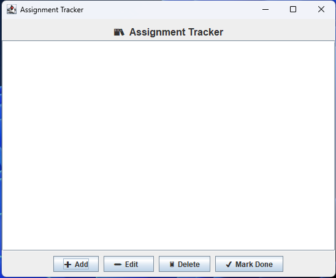

Assignment Tracker
A lightweight desktop application for tracking school assignments. Built with Java Swing, it lets you add, edit, delete, and mark assignments as complete — and automatically saves everything between sessions so nothing is ever lost.
Features
FeatureDescriptionAdd assignmentsEnter a name, due date, and point valueAuto-sorted listAssignments stay ordered by due date; ties broken by point value (highest first)Edit in placeUpdate any field of an existing assignment at any timeDeleteRemove an assignment with a confirmation promptMark completeToggle done/pending status — completed entries are grayed out with a ✔Persistent storageAll data is saved to assignments.dat automatically on every change

AssignmentTracker/
├── Assignment.java       # Data model: name, due date, points, completion status
├── AssignmentList.java   # Sorted collection of Assignment objects
├── AssignmentGUI.java    # Swing window, buttons, custom cell renderer
├── FileManager.java      # Saves and loads the list using Java serialization
├── Program.java          # Entry point — launches the GUI on the EDT
└── assignments.dat       # Auto-generated at runtime; stores your data
